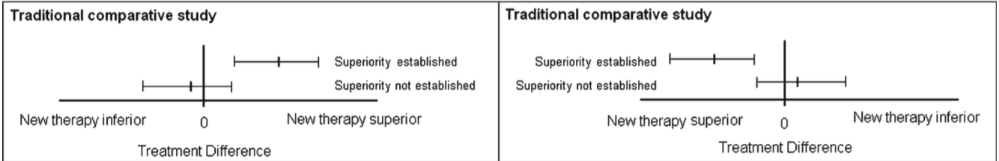
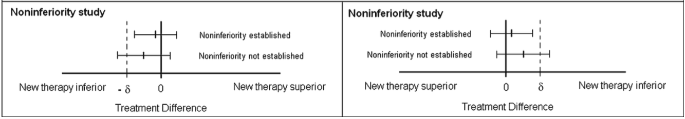

Equivalence & Non-Inferiority Testing
========================================================
author: Tinashe M. Tapera
date: 10 November 2016
PSY 610: Data Analysis I

Based on the paper by Walker & Nowacki, 2010

Hypothesis Testing In Practice
========================================================

- The goal of many clinical studies is to show that new drugs and therapies are either equivalent to, or better than, existing methods

- High stakes require high levels of confidence, hence rigorous statistical testing

- Recall:

$H _{0}: \mu= \overline {x}$

$H _{A}: \mu > \overline {x}$ ,   or,   $\mu < \overline {x}$ ,   or both

*In hypothesis testing, the goal is to disprove the null hypothesis*

Introducing Equivalence & Non-Inferiority
========================================================
*Which hypothesis carries the burden of proof?*

|TestType        |NullHyp                |AlternativeHyp             |
|:---------------|:----------------------|:--------------------------|
|Comparative     |No difference          |Difference                 |
|Equivalence     |No Equivalence         |New is equivalent to old   |
|Non-inferiority |New is inferior to old |New is not inferior to old |

- The problem with traditional hypothesis testing: 
*If what we are looking for is a difference, similarity is going to be very easy to accept*

- But what if we need a non-difference?

Equivalence Explained
========================================================
- By *equivalence*, we mean that:

"...the efficacies of the two therapies are close
enough so that one cannot be considered superior or inferior to
the other."

- By *non-inferiority*, we mean that:

"...the efficacy of the new therapy is no more than $\delta$ units less than that of the current therapy (assuming higher is better)."


```
[1] "Walker and Nowacki (2010)"
```

The Equivalence Margin
========================================================

The equivalence margin $\delta$ is a constant:

- Range of values to denote efficacies are "close enough"

- Maximum clinically acceptable difference

The Two One-Sided Test
======================================================
- Most common method of equivalence testing
- Equivalence is established for a given $\alpha$ if confidence interval for the difference in efficacies is within the $\delta$ interval
- Recall that confidence interval is a range of values related to $\alpha$ that estimates the margin of error:

$(1-\alpha) \times 100\% CI$ for $\mu  =  \overline{x} \pm ME$

- Since we run two tests, our interval uses 2$\alpha$
- Therefore, for an equivalence test, we want our confidence interval to be inside these $\delta$ intervals
- For a non-inferiority test, we want one side of our confidence interval to fall beyond the $\delta$ interval

Explained Visually: Traditional Studies
========================================================


Explained Visually: Equivalence Study
========================================================


Explained Visually: Non-inferiority Studies
========================================================


Equivalence Margin
===================================
- Like $\alpha$, this must be determined *a priori*
- Small $\delta$ = more strict testing
- "An equivalence/noninferiority study should be designed to minimize the possibility that a new therapy that is found to be equivalent/noninferior to the current therapy can be nonsuperior to a placebo."
- For non-inferiority, $\delta$ can be set to a fraction, $f$

Non-Difference Does Not Equal Equivalence
=====================================================

- In traditional hypothesis testing, type I error for finding equivalence is high

Works Cited
======================================================
<p><a id='bib-Walker_2010'></a><a href="#cite-Walker_2010">[1]</a><cite>
E. Walker and A. S. Nowacki.
&ldquo;Understanding Equivalence and Noninferiority Testing&rdquo;.
In: <em>Journal of General Internal Medicine</em> 26.2 (Sep. 2010), pp. 192&ndash;196.
DOI: <a href="http://dx.doi.org/10.1007/s11606-010-1513-8">10.1007/s11606-010-1513-8</a>.
URL: <a href="http://dx.doi.org/10.1007/s11606-010-1513-8">http://dx.doi.org/10.1007/s11606-010-1513-8</a>.</cite></p>
